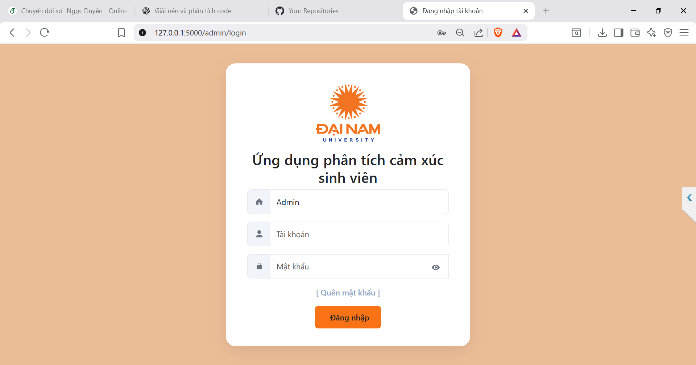
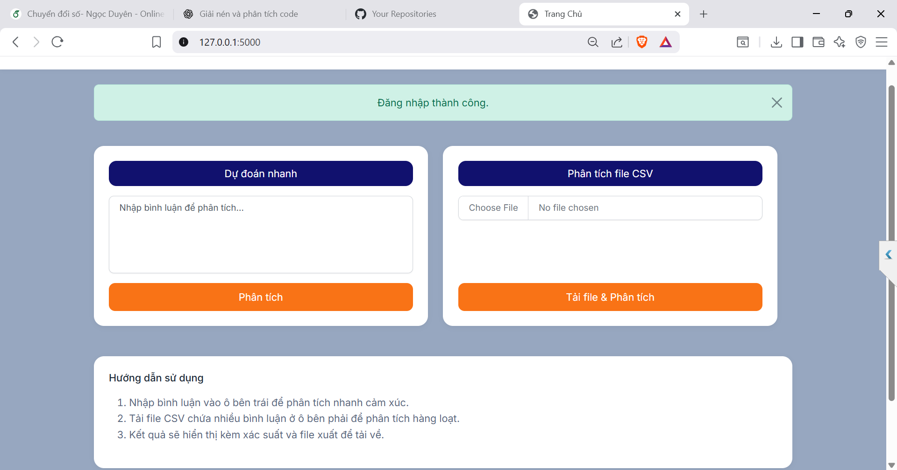
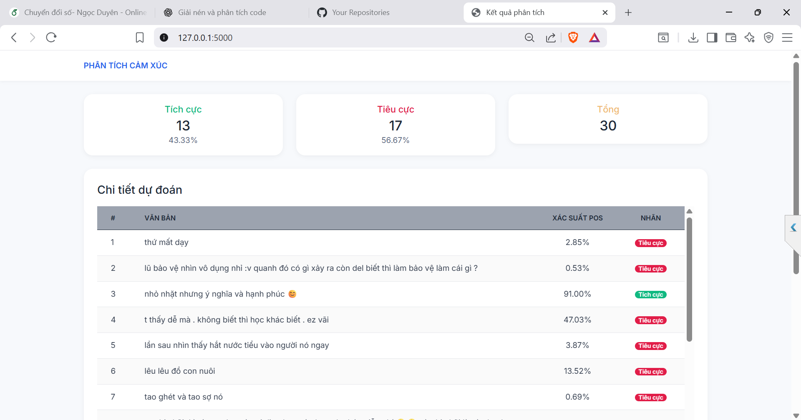
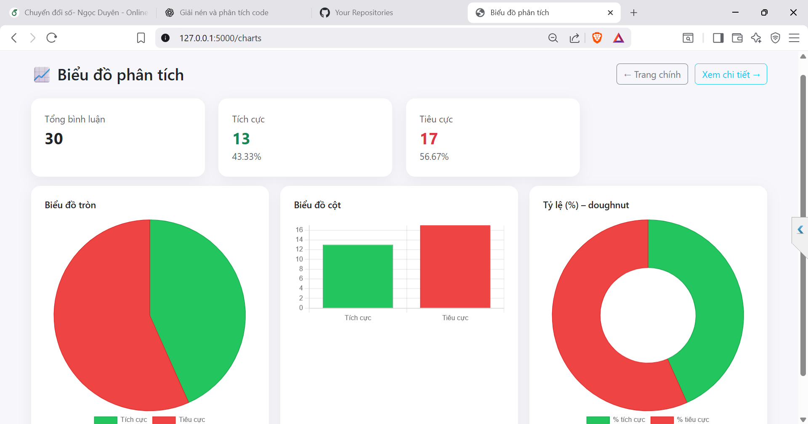

 <h2 align="center">
    <a href="https://dainam.edu.vn/vi/khoa-cong-nghe-thong-tin">
    🎓 Faculty of Information Technology (DaiNam University)
    </a>
</h2>
<h2 align="center">
   ỨNG DỤNG PHÂN TÍCH CẢM XÚC TỪ PHẢN HỒI SINH VIÊN TRÊN FACEBOOK
</h2>
<div align="center">
    <p align="center">
        
        
        
    </p>

[](https://www.facebook.com/DNUAIoTLab)
[](https://dainam.edu.vn/vi/khoa-cong-nghe-thong-tin)
[](https://dainam.edu.vn)


</div>

## 💡1. Tổng quan về hệ thống
Hệ thống phân tích cảm xúc từ file CSV là ứng dụng web cho phép người dùng tải lên dữ liệu phản hồi hoặc bình luận dưới dạng bảng (CSV). Sau khi nhận dữ liệu, hệ thống tự động xác định cột chứa nội dung văn bản và sử dụng mô hình phân tích cảm xúc được huấn luyện sẵn (kết hợp TF-IDF và XGBoost) để phân loại mỗi dòng dữ liệu thành hai nhóm cảm xúc chính: tích cực (Positive) hoặc tiêu cực (Negative).

Kết quả phân tích được xử lý và trả về theo hai hình thức:

1. Một file CSV mới chứa nhãn phân tích cảm xúc và xác suất dự đoán cho từng bản ghi.

2. Giao diện trực quan thể hiện thống kê số lượng tích cực/tiêu cực, tỷ lệ phần trăm và danh sách các bình luận tích cực/tiêu cực nổi bật.

Hệ thống có trang quản trị (Admin) để quản lý file đã tải lên và file kết quả, đồng thời hỗ trợ xem lại lịch sử phân tích. Toàn bộ ứng dụng được triển khai trên nền Flask, không yêu cầu cơ sở dữ liệu, chạy nhẹ, dễ triển khai và phù hợp cho việc demo, báo cáo hoặc sử dụng trong thực tế khi cần xử lý nhanh số lượng lớn phản hồi dạng text.

### 💻 Thành phần chính
Ứng dụng gồm các thành phần chính sau:
### 1) Giao diện Web (Frontend)
- Upload CSV chứa văn bản cần phân tích.
- Hiển thị bảng kết quả, biểu đồ tỷ lệ POS/NEG.
- Cho phép tải xuống CSV kết quả.

### 2) Backend xử lý (Flask)
- Nhận file, đọc dữ liệu bằng `pandas`.
- Gọi mô hình ML để suy luận và trả kết quả cho giao diện.

### 3) Mô hình phân tích cảm xúc (AI/ML)
- Pipeline: **TF-IDF** (biểu diễn văn bản) → **XGBoost** (phân loại).
- Trả về:
  - `prob_pos` (xác suất tích cực),
  - `prob_neg` (xác suất tiêu cực),
  - `pred_label` (nhãn cuối cùng POS/NEG).
- Model lưu dưới dạng `.joblib` trong `runs_xgb/`.

### 4) Dashboard quản trị (Admin)
- Đăng nhập quản trị.
- Xem lịch sử file đã upload và file kết quả.
- Tải lại file đầu ra trực tiếp từ Dashboard.

### 5) Lưu trữ file
| Thư mục   | Mô tả                                   |
|-----------|------------------------------------------|
| `uploads/`| CSV đầu vào người dùng upload            |
| `outputs/`| CSV đầu ra (đã phân tích cảm xúc)        |
| `runs_xgb/` | Mô hình TF-IDF + XGBoost (`.joblib`)  |

## 🧰 2. CÔNG NGHỆ SỬ DỤNG

[](https://www.python.org/)
[](https://flask.palletsprojects.com/)
[](https://xgboost.ai/)
[](https://pandas.pydata.org/)
[]()

- **Ngôn ngữ lập trình:** Python 3.10  
- **Backend Web Framework:** Flask – nhẹ, dễ triển khai, phù hợp xử lý file CSV theo request.  
- **Xử lý dữ liệu:** `pandas` đọc CSV, nhận diện cột văn bản.  
- **AI phân tích cảm xúc:**  
  - TF-IDF chuyển đổi văn bản → vector đặc trưng  
  - XGBoost dự đoán cảm xúc POS/NEG và xác suất  
- **Frontend:** HTML5, CSS3, Bootstrap (giao diện upload CSV + xem kết quả)  

## 📸 3. Hình ảnh các giao diện

###  Giao diện Đăng nhập
<p align="center">
  
  <br>
 <em> Hình 1: Giao diện Đăng nhập </em>
</p>

###  Giao diện Chính
<p align="center">
  
  <br>
 <em> Hình 2: Giao diện Chính </em>
</p>

###  Giao diện phân tích cảm xúc
<p align="center">
  
  <br>
<em> Hình 3: Giao diện phân tích cảm xúc </em>
</p>

###  Giao diện biểu đồ phân tích
<p align="center">
  
  <br>
<em> Hình 4: Giao diện biểu đồ phân tích </em>
</p>

###  Giao diện chi tiết phân tích
<p align="center">
  
  <br>
<em> Hình 5: Giao diện chi tiết phân tích </em>
</p>

## ⚙️ 4. CÁC BƯỚC CÀI ĐẶT & CHẠY ỨNG DỤNG

### 🧩 4.1. Yêu cầu hệ thống
| Thành phần | Phiên bản khuyến nghị | Ghi chú |
|-------------|----------------------|----------|
| **Python** | ≥ 3.10 | Đảm bảo đã thêm vào PATH |
| **Pip** | Mặc định theo Python | Dùng để cài thư viện |
| **Git** | (Tùy chọn) | Dùng để clone project |
| **Trình duyệt web** | Chrome / Edge / Brave | Dùng để truy cập giao diện hệ thống |
| **IDE khuyến nghị** | VSCode / PyCharm | Hỗ trợ virtualenv & gợi ý code |

---

### 🏗️ 4.2. Thiết lập dự án
### 🔹 Bước 1. Tải & mở thư mục dự án
Giải nén file ZIP, sau đó mở terminal/cmd và trỏ đến thư mục dự án:

```bash
cd "CDS- final/demo_cds"
```
---

### 🔹 Bước 2. (Tuỳ chọn) Kiểm tra Python & pip

```bash
python --version
pip --version
```

Nếu trên Windows dùng `py`:

```bash
py --version
py -m pip --version
```

---

### 🔹 Bước 3. Tạo môi trường ảo (virtual environment)

```bash
python -m venv venv
```

---

### 🔹 Bước 4. Kích hoạt môi trường ảo

**Windows (PowerShell):**
```powershell
.env\Scripts\Activate.ps1
```

⚠️ Nếu gặp lỗi `execution policy`, chạy:

```powershell
Set-ExecutionPolicy -Scope Process -ExecutionPolicy Bypass
.env\Scripts\Activate.ps1
```

**Windows (CMD):**
```cmd
venv\Scripts\activate.bat
```

**macOS / Linux:**
```bash
source venv/bin/activate
```

---

### 🔹 Bước 5. Cài đặt thư viện cần thiết

```bash
pip install -r requirements.txt
```

---

### 🔹 Bước 6. Kiểm tra mô hình đã tồn tại

Mô hình phân tích cảm xúc đã được huấn luyện sẵn và lưu tại:

```
runs_xgb/xgb_tfidf_pipeline.joblib
```
---
### 🚀 4.3. Chạy ứng dụng

### 🔸 Khởi động ứng dụng Flask
Sau khi hoàn tất bước cài đặt, chạy lệnh sau trong terminal:

```bash
python app.py
```

Nếu chạy thành công, terminal sẽ hiển thị:
```
 * Running on http://127.0.0.1:5000
```

---

### 🔸 Mở giao diện web (Frontend)

- Truy cập trình duyệt và mở địa chỉ:

👉 http://127.0.0.1:5000/admin/login

- Đăng nhập bằng tài khoản mặc định:

```
Username: admin
Password: 123456
```

---

### 🔸 Thao tác trên hệ thống

| Chức năng | Mô tả |
|----------|------|
| Upload CSV | Chọn file `.csv` chứa dữ liệu văn bản để phân tích |
| Phân tích cảm xúc | Hệ thống dùng mô hình **TF-IDF + XGBoost** để phân loại Positive / Negative |
| Xuất kết quả | Tải về file kết quả dưới dạng CSV |
| Xem biểu đồ | Hiển thị thống kê số lượng tích cực / tiêu cực |
| Dashboard | Xem và tải lại các file đã xử lý trước đó |

---


### 📞 5. Liên hệ
- 👨‍🎓 **Sinh viên thực hiện**: Trần Ngọc Duyên
- 🎓 **Khoa**: Công nghệ thông tin – Đại học Đại Nam
- 📧 **Email**: duyenmam2004@gmail.com


